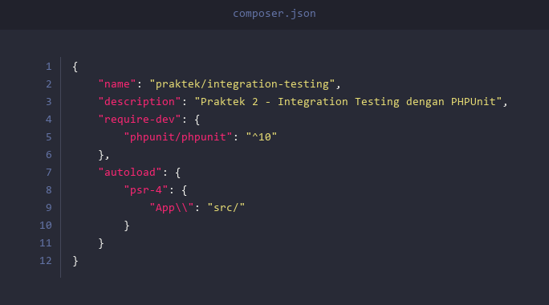
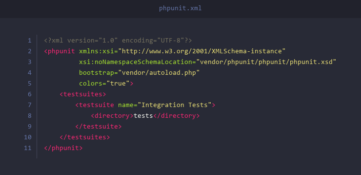
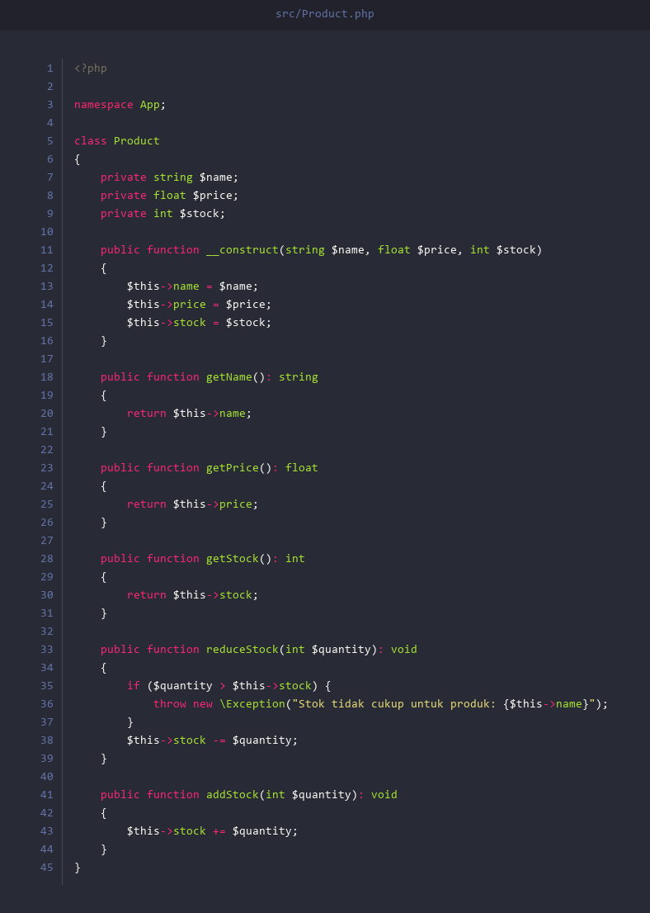
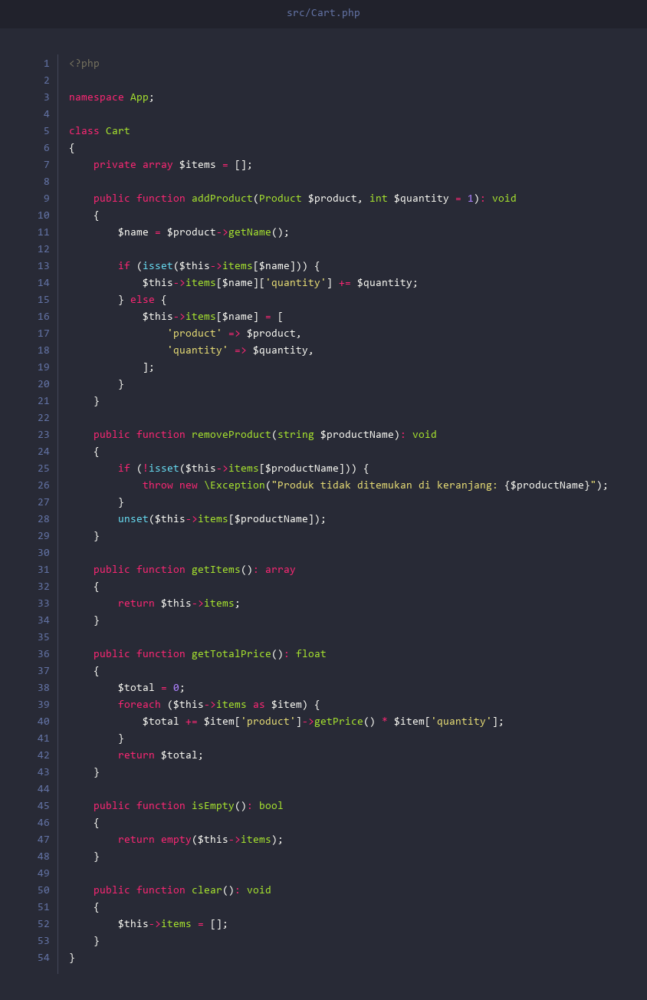
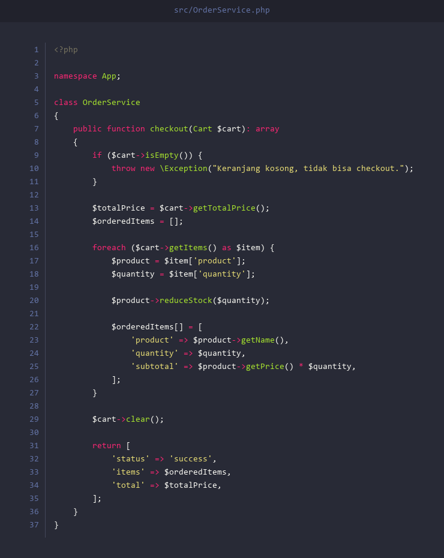
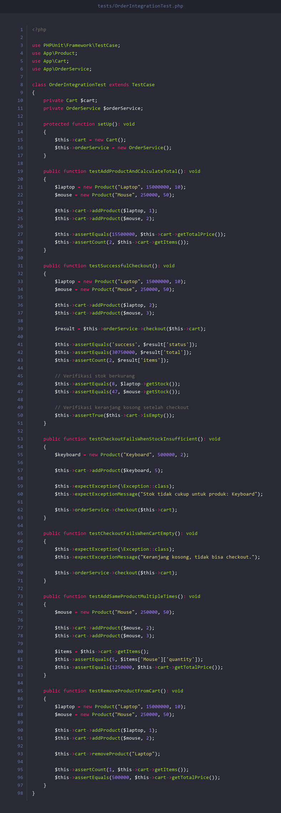

# Praktek 2: Integration Testing

## Apa itu Integration Testing?

**Integration Testing** adalah jenis pengujian perangkat lunak yang menguji **interaksi antar komponen/modul** dalam sebuah sistem. Berbeda dengan Unit Testing yang menguji satu komponen secara terpisah, Integration Testing memastikan bahwa komponen-komponen tersebut bekerja dengan benar **ketika digabungkan**.

Contoh sederhana:
- **Unit Testing**: Menguji apakah class `Cart` bisa menambah produk (hanya class Cart saja).
- **Integration Testing**: Menguji apakah proses **checkout lengkap** berjalan benar — dari menambah produk ke keranjang, memvalidasi stok, mengurangi stok, sampai menghasilkan order.

---

## Perbedaan Unit Testing vs Integration Testing

| Aspek | Unit Testing | Integration Testing |
|-------|-------------|-------------------|
| **Cakupan** | Satu class/method saja | Beberapa class/komponen sekaligus |
| **Tujuan** | Memastikan satu unit bekerja benar | Memastikan komponen bekerja benar saat digabungkan |
| **Kecepatan** | Sangat cepat | Lebih lambat dari unit test |
| **Kompleksitas** | Sederhana | Lebih kompleks |
| **Contoh** | Test method `getPrice()` | Test proses checkout (Cart + Product + OrderService) |
| **Isolasi** | Terisolasi penuh | Menguji interaksi nyata antar komponen |

---

## Persiapan

### 1. Install XAMPP

Pastikan XAMPP sudah terinstall di komputer. XAMPP menyediakan PHP yang kita butuhkan.

Download di: [https://www.apachefriends.org/download.html](https://www.apachefriends.org/download.html)

Setelah install, pastikan PHP bisa diakses dari terminal/command prompt:

```
php -v
```

Jika muncul versi PHP (misal `PHP 8.x.x`), berarti PHP sudah siap.

> **Catatan:** Jika perintah `php -v` tidak dikenali, tambahkan path PHP ke Environment Variables. Path default: `C:\xampp\php`

### 2. Install Composer

Composer adalah dependency manager untuk PHP (seperti npm untuk Node.js).

Download di: [https://getcomposer.org/download/](https://getcomposer.org/download/)

Setelah install, verifikasi:

```
composer --version
```

### 3. Buat Project Baru

Buat folder baru untuk project ini, lalu masuk ke folder tersebut:

```
mkdir integration-testing
cd integration-testing
```

### 4. Inisialisasi Composer & Install PHPUnit

Buat file `composer.json` di root folder project:



Lalu jalankan:

```
composer install
```

### 5. Konfigurasi PHPUnit

Buat file `phpunit.xml` di root folder project:



### 6. Buat Struktur Folder

Buat folder `src` dan `tests`:

```
mkdir src
mkdir tests
```

Struktur project akhir:

```
integration-testing/
├── composer.json
├── phpunit.xml
├── src/
│   ├── Product.php
│   ├── Cart.php
│   └── OrderService.php
└── tests/
    └── OrderIntegrationTest.php
```

---

## Studi Kasus: Sistem Shopping Cart

Kita akan membuat sistem shopping cart sederhana yang terdiri dari **3 class** yang saling berinteraksi:

1. **Product** — Merepresentasikan produk (nama, harga, stok)
2. **Cart** — Keranjang belanja (tambah/hapus produk, hitung total)
3. **OrderService** — Service yang memproses checkout (validasi stok, kurangi stok, buat order)

### Alur Interaksi:

```
Product  ──►  Cart  ──►  OrderService
(data)      (kumpul)     (proses checkout)
```

Ketika `OrderService` memproses checkout:
1. Cek apakah keranjang kosong
2. Hitung total harga
3. Untuk setiap produk, kurangi stok di `Product`
4. Kosongkan keranjang
5. Kembalikan hasil order

---

## Membuat Source Code

### File 1: `src/Product.php`

Buat file `Product.php` di dalam folder `src/`:



**Penjelasan:**
- Class `Product` memiliki 3 property: `name`, `price`, dan `stock`
- Method `reduceStock()` mengurangi stok dan melempar `Exception` jika stok tidak cukup
- Namespace `App` digunakan agar autoloading dengan Composer berjalan

---

### File 2: `src/Cart.php`

Buat file `Cart.php` di dalam folder `src/`:



**Penjelasan:**
- `addProduct()` menambahkan produk ke keranjang. Jika produk sudah ada, quantity-nya ditambah
- `removeProduct()` menghapus produk dari keranjang
- `getTotalPrice()` menghitung total harga semua produk di keranjang
- `isEmpty()` mengecek apakah keranjang kosong
- `clear()` mengosongkan keranjang

---

### File 3: `src/OrderService.php`

Buat file `OrderService.php` di dalam folder `src/`:



**Penjelasan:**
- `checkout()` memproses seluruh isi keranjang
- Pertama, cek apakah keranjang kosong
- Kemudian, untuk setiap item, kurangi stok di object `Product` (method `reduceStock`)
- Setelah semua berhasil, kosongkan keranjang
- Kembalikan array berisi status, detail items, dan total harga
- Jika stok tidak cukup, `Product::reduceStock()` akan melempar Exception

---

## Membuat Integration Test

### File: `tests/OrderIntegrationTest.php`

Buat file `OrderIntegrationTest.php` di dalam folder `tests/`:



**Penjelasan setiap test method:**

| Test Method | Yang Diuji |
|------------|------------|
| `testAddProductAndCalculateTotal` | Menambah 2 produk ke Cart lalu cek total harga — menguji interaksi **Product + Cart** |
| `testSuccessfulCheckout` | Proses checkout lengkap — menguji interaksi **Product + Cart + OrderService**, memverifikasi stok berkurang dan keranjang kosong |
| `testCheckoutFailsWhenStockInsufficient` | Checkout gagal karena stok kurang — menguji interaksi **OrderService + Product** saat Exception dilempar |
| `testCheckoutFailsWhenCartEmpty` | Checkout gagal karena keranjang kosong — menguji validasi di **OrderService** |
| `testAddSameProductMultipleTimes` | Tambah produk yang sama 2 kali — menguji logika penggabungan quantity di **Cart + Product** |
| `testRemoveProductFromCart` | Hapus produk dari keranjang lalu cek total — menguji **Cart** setelah modifikasi |

> **Mengapa ini Integration Test?**
> Karena kita menguji **interaksi nyata** antar beberapa class (Product, Cart, OrderService) sekaligus. Kita tidak mengisolasi satu class saja — kita menggunakan object asli dan menguji alur kerja lengkap dari awal sampai akhir.

---

## Menjalankan Test

Buka terminal/command prompt di folder project, lalu jalankan:

```
vendor\bin\phpunit
```

Jika semua test berhasil, output akan terlihat seperti ini:

```
PHPUnit 10.x.x by Sebastian Bergmann and contributors.

......                                                              6 / 6 (100%)

Time: 00:00.xxx, Memory: x.xx MB

OK (6 tests, 12 assertions)
```

Penjelasan output:
- `......` — Setiap titik artinya satu test **berhasil** (pass)
- `6 / 6 (100%)` — Semua 6 test dijalankan
- `OK (6 tests, 12 assertions)` — 6 test method dengan total 12 assertion, semuanya pass

Untuk menjalankan test tertentu saja:

```
vendor\bin\phpunit --filter testSuccessfulCheckout
```

---

## Kesimpulan

Pada praktek ini, kita telah mempelajari:

1. **Integration Testing** menguji bagaimana beberapa komponen bekerja bersama, bukan hanya satu komponen secara terpisah
2. Kita membuat 3 class yang saling berinteraksi: `Product`, `Cart`, dan `OrderService`
3. Test kita memverifikasi **alur kerja lengkap** — dari menambah produk, menghitung total, sampai proses checkout
4. Integration Testing penting karena unit test yang pass **tidak menjamin** komponen bekerja benar ketika digabungkan

### Kapan Menggunakan Integration Testing?
- Ketika ada **beberapa class/modul** yang saling bergantung
- Ketika ingin memastikan **alur bisnis** berjalan dengan benar secara end-to-end
- Ketika ada proses yang melibatkan **perubahan state** di beberapa object sekaligus (seperti stok berkurang + keranjang kosong setelah checkout)

---

## Soal Latihan

Kerjakan 2 soal berikut menggunakan project yang sudah dibuat di atas. Tambahkan class baru di folder `src/` dan test baru di folder `tests/`.

---

### Soal 1: DiscountService

Buatlah class `DiscountService` di `src/DiscountService.php` dengan **1 method**:

- `applyDiscount(Cart $cart, float $percent): float` — Menghitung total harga keranjang setelah dipotong diskon persen. Contoh: total Rp 1.000.000 dengan diskon 10% = Rp 900.000.

**Buatlah Integration Test** di `tests/DiscountIntegrationTest.php` yang menguji:
1. Tambah beberapa produk ke keranjang, lalu hitung harga setelah diskon 10%
2. Diskon 0% — harga tetap sama

---

### Soal 2: ShippingService

Buatlah class `ShippingService` di `src/ShippingService.php` dengan **1 method**:

- `calculateCost(Cart $cart): float` — Menghitung ongkos kirim. Jika total harga keranjang **di atas Rp 500.000**, ongkir **gratis** (return `0`). Jika tidak, ongkir **Rp 20.000**.

**Buatlah Integration Test** di `tests/ShippingIntegrationTest.php` yang menguji:
1. Keranjang dengan total di atas Rp 500.000 — ongkir gratis (0)
2. Keranjang dengan total di bawah Rp 500.000 — ongkir Rp 20.000
