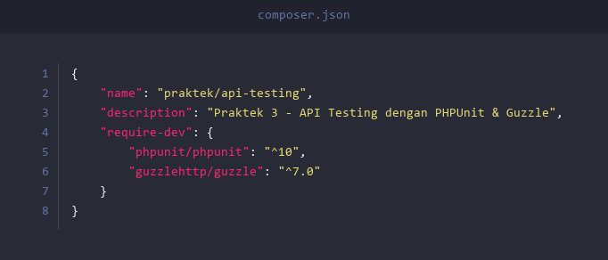
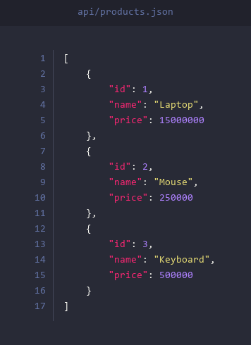
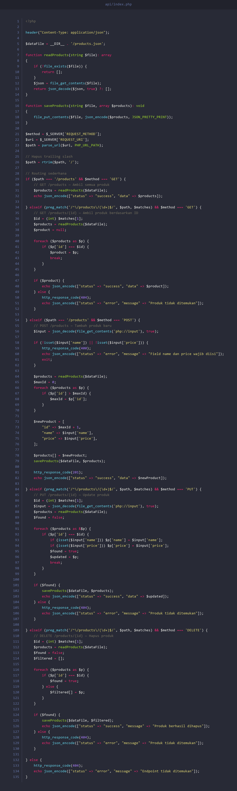
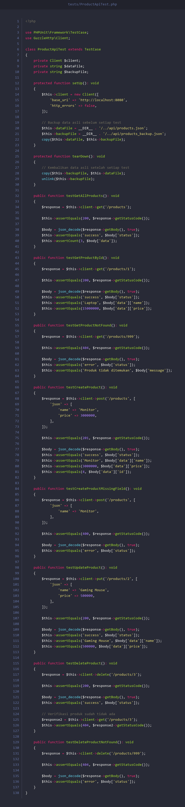

# Praktek 3: API Testing

## Apa itu API Testing?

**API Testing** adalah jenis pengujian yang menguji **Application Programming Interface (API)** secara langsung — tanpa melalui tampilan (UI). Kita mengirim **HTTP request** (GET, POST, PUT, DELETE) ke endpoint API, lalu memeriksa apakah **response** yang dikembalikan sudah benar.

Contoh sederhana:
- Kirim `GET /products` → harusnya mendapat daftar semua produk
- Kirim `POST /products` dengan data `{"name": "Laptop", "price": 15000000}` → harusnya produk baru dibuat
- Kirim `DELETE /products/1` → harusnya produk dengan ID 1 terhapus

---

## Perbedaan API Testing dengan Testing Lainnya

| Aspek | Unit Testing | Integration Testing | API Testing |
|-------|-------------|-------------------|-------------|
| **Yang Diuji** | Satu class/method | Interaksi antar class | HTTP endpoint (request & response) |
| **Level** | Kode internal | Kode internal | Dari luar aplikasi (HTTP) |
| **Tools** | PHPUnit | PHPUnit | PHPUnit + Guzzle / Postman |
| **Contoh** | Test method `getPrice()` | Test Cart + Product + OrderService | Test `GET /products` return 200 |

---

## Persiapan

### 1. Install XAMPP

Pastikan XAMPP sudah terinstall di komputer. XAMPP menyediakan PHP yang kita butuhkan.

Download di: [https://www.apachefriends.org/download.html](https://www.apachefriends.org/download.html)

Setelah install, pastikan PHP bisa diakses dari terminal/command prompt:

```
php -v
```

> **Catatan:** Jika perintah `php -v` tidak dikenali, tambahkan path PHP ke Environment Variables. Path default: `C:\xampp\php`

### 2. Install Composer

Composer adalah dependency manager untuk PHP.

Download di: [https://getcomposer.org/download/](https://getcomposer.org/download/)

Setelah install, verifikasi:

```
composer --version
```

### 3. Buat Project Baru

Buat folder baru untuk project ini:

```
mkdir api-testing
cd api-testing
```

### 4. Buat `composer.json`

Buat file `composer.json` di root folder project. Kali ini kita membutuhkan **GuzzleHttp** — library untuk mengirim HTTP request dari PHP:



Lalu jalankan:

```
composer install
```

### 5. Buat `phpunit.xml`

Buat file `phpunit.xml` di root folder project:


### 6. Buat Struktur Folder

```
mkdir api
mkdir tests
```

Struktur project akhir:

```
api-testing/
├── composer.json
├── phpunit.xml
├── api/
│   ├── index.php          ← REST API (router + handler)
│   └── products.json      ← Data produk (sebagai pengganti database)
└── tests/
    └── ProductApiTest.php  ← API Test
```

---

## Studi Kasus: REST API Produk (CRUD)

Kita akan membuat REST API sederhana untuk mengelola data produk, lalu **menguji semua endpoint-nya** menggunakan PHPUnit + Guzzle.

### Endpoint yang Akan Dibuat:

| Method | Endpoint | Fungsi |
|--------|----------|--------|
| `GET` | `/products` | Ambil semua produk |
| `GET` | `/products/{id}` | Ambil produk berdasarkan ID |
| `POST` | `/products` | Tambah produk baru |
| `PUT` | `/products/{id}` | Update produk |
| `DELETE` | `/products/{id}` | Hapus produk |

### Konsep Penting:

- **HTTP Method** — Jenis operasi (GET = baca, POST = buat, PUT = update, DELETE = hapus)
- **Status Code** — Kode response (200 = OK, 201 = Created, 400 = Bad Request, 404 = Not Found)
- **JSON** — Format data yang dikirim dan diterima oleh API
- **Guzzle** — Library PHP untuk mengirim HTTP request (seperti browser, tapi dari kode)

---

## Membuat Data Awal

### File: `api/products.json`

Buat file `products.json` di dalam folder `api/`. File ini menyimpan data produk (pengganti database):



---

## Membuat REST API

### File: `api/index.php`

Buat file `index.php` di dalam folder `api/`. File ini adalah inti dari API — menerima request dan mengembalikan response:



**Penjelasan:**
- `readProducts()` dan `saveProducts()` — Membaca dan menyimpan data ke file JSON
- Routing menggunakan `$_SERVER['REQUEST_METHOD']` dan `$_SERVER['REQUEST_URI']`
- Setiap endpoint mengembalikan **JSON response** dengan field `status` dan `data`/`message`
- `http_response_code()` mengatur status code HTTP yang dikembalikan
- `php://input` membaca body dari request POST/PUT

---

## Menjalankan API Server

Sebelum menjalankan test, kita perlu **menghidupkan API server** terlebih dahulu menggunakan PHP built-in server.

Buka **terminal/command prompt pertama**, masuk ke folder project, lalu jalankan:

```
php -S localhost:8080 -t api
```

Penjelasan:
- `php -S localhost:8080` — Menjalankan server di `http://localhost:8080`
- `-t api` — Mengarahkan root server ke folder `api/`

> **Penting:** Biarkan terminal ini tetap terbuka! Server harus tetap berjalan selama test dijalankan.

Untuk memastikan server berjalan, buka browser dan akses:

```
http://localhost:8080/products
```

Seharusnya muncul data JSON berisi daftar produk.

---

## Membuat API Test

### File: `tests/ProductApiTest.php`

Buka **terminal/command prompt kedua** (jangan tutup yang pertama!). Buat file `ProductApiTest.php` di dalam folder `tests/`:



**Penjelasan setiap test method:**

| Test Method | Yang Diuji | Status Code |
|------------|------------|-------------|
| `testGetAllProducts` | `GET /products` — Ambil semua produk, cek ada 3 data | 200 |
| `testGetProductById` | `GET /products/1` — Ambil produk Laptop berdasarkan ID | 200 |
| `testGetProductNotFound` | `GET /products/999` — Akses produk yang tidak ada | 404 |
| `testCreateProduct` | `POST /products` — Buat produk baru "Monitor" | 201 |
| `testCreateProductMissingField` | `POST /products` tanpa field `price` | 400 |
| `testUpdateProduct` | `PUT /products/2` — Update Mouse jadi "Gaming Mouse" | 200 |
| `testDeleteProduct` | `DELETE /products/3` — Hapus Keyboard, lalu verifikasi sudah hilang | 200 + 404 |
| `testDeleteProductNotFound` | `DELETE /products/999` — Hapus produk yang tidak ada | 404 |

**Konsep penting dalam test ini:**
- `setUp()` — Backup data `products.json` sebelum setiap test
- `tearDown()` — Kembalikan data asli setelah setiap test (agar test tidak saling mempengaruhi)
- `http_errors => false` — Supaya Guzzle tidak melempar exception saat menerima status 4xx/5xx

---

## Menjalankan Test

Pastikan server masih berjalan di terminal pertama, lalu buka terminal kedua dan jalankan:

```
php vendor/bin/phpunit
```

Jika semua test berhasil:

```
PHPUnit 10.x.x by Sebastian Bergmann and contributors.

........                                                            8 / 8 (100%)

Time: 00:00.xxx, Memory: x.xx MB

OK (8 tests, 26 assertions)
```

Penjelasan output:
- `........` — 8 titik = 8 test berhasil
- `OK (8 tests, 26 assertions)` — Semua test pass

---

## Kesimpulan

Pada praktek ini, kita telah mempelajari:

1. **API Testing** menguji endpoint HTTP dari luar aplikasi — bukan kode internal
2. Kita membuat **REST API** sederhana dengan PHP yang mendukung operasi **CRUD** (Create, Read, Update, Delete)
3. Kita menggunakan **GuzzleHttp** untuk mengirim HTTP request dari test
4. Setiap test memverifikasi **status code** dan **isi response body**
5. `setUp()` dan `tearDown()` digunakan untuk menjaga **isolasi data** antar test

### Kapan Menggunakan API Testing?
- Ketika aplikasi memiliki **REST API** yang perlu diverifikasi
- Ketika ingin menguji **dari sudut pandang client** (bukan kode internal)
- Ketika ingin memastikan **status code, response format, dan business logic** dari API sudah benar

---

## Soal Latihan

Kerjakan 2 soal berikut menggunakan project yang sudah dibuat di atas.

---

### Soal 1: Test Search Product

Tambahkan endpoint baru di `api/index.php`:

- `GET /products/search?name=laptop` — Mencari produk berdasarkan nama (case-insensitive). Kembalikan semua produk yang **mengandung** kata tersebut.

**Format response** (status 200):
```json
{"status": "success", "data": [{"id": 1, "name": "Laptop", "price": 15000000}]}
```

**Buatlah test** di `ProductApiTest.php` yang menguji:
1. Search dengan kata "laptop" — harus menemukan 1 produk
2. Search dengan kata "xyz" — harus return array kosong

---

### Soal 2: Test Product Count

Tambahkan endpoint baru di `api/index.php`:

- `GET /products/count` — Mengembalikan jumlah total produk.

**Format response** (status 200):
```json
{"status": "success", "count": 3}
```

**Buatlah test** di `ProductApiTest.php` yang menguji:
1. Count produk — harus return 3 (sesuai data awal)
